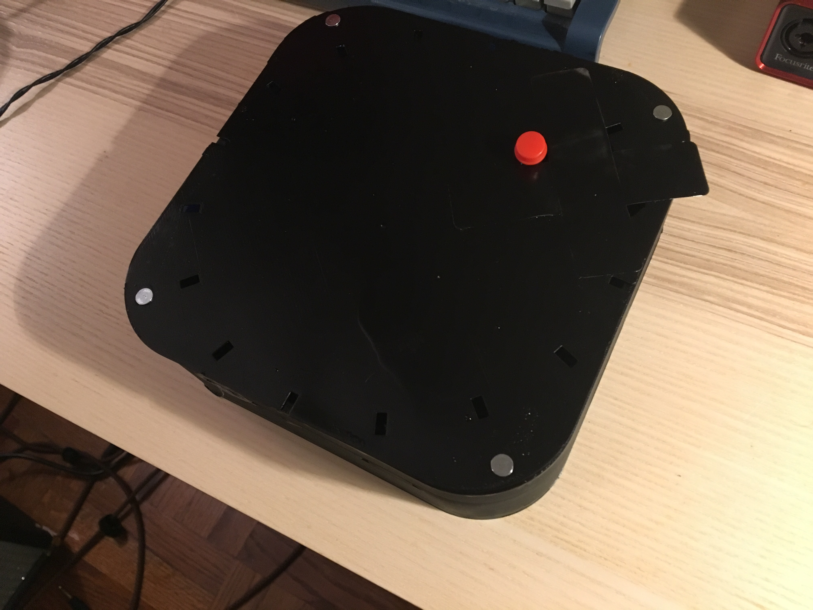
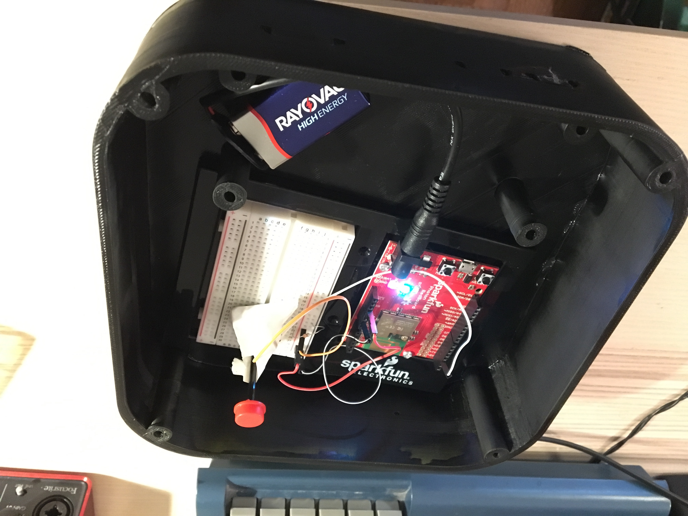
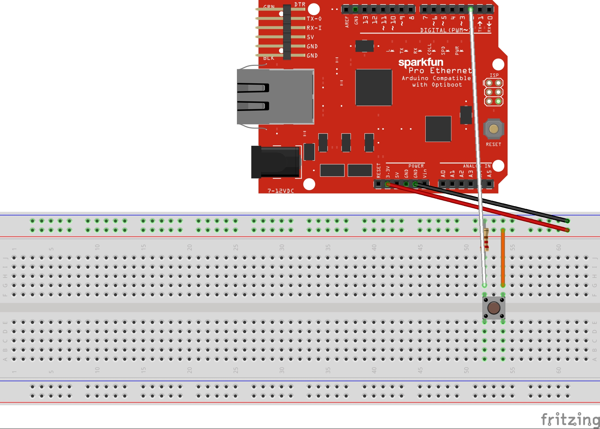

# Midterm IoT Project

Name: Rob Arcand / kra16

Date: 10/12/2017

## Project: BlackBox

### Conceptual Description

BlackBox is an exploration of the tension between the opaque nature of many current smart home devices and the knotted history of raw materials at the heart of their production. The most basic literalization of the "blackbox" metaphor commonplace in many IoT devices, the piece wraps its electronic components in a smooth molded casing that renders many of its components nearly invisible to outside viewers. Masking its flash memory, RAM, wifi components, and basic circuitry beneath this casing, the work blurs the distinction between software and hardware, striving for the most essential baseline connection between user interface and internet connection in the sleek minimization of its material presence.

Yet with a single button, the piece flips the outward gaze of most internet-connected smart home devices instead inward, peeling back each layer of electrical components and network connectivity to now make “visible” its own material ontology. Through a series of notifications pushed to their smartphones, users are forced to slow down, meditating on each part of the greater whole, its contribution to the piece itself, and its material implications after disposal in which, unless the user/consumer specifically intervenes, will almost surely result in the piece being thrown away without any attempt to repurpose or recycle. Far from a simple condemnation of recycling habits, the piece strives to ask bigger questions about the material implications of all quote-unquote “blackboxes,” the security of the data they collect, and the unwavering reality of their short lifespans and complex supply chains, at least in the current cultural moment.

### Form

The project's form is a 3D printout of an open-source model based on an Apple TV and designed by StudioPieters in the Netherlands. Their model was originally designed for a Raspberry Pi for use as an IoT device in their own studio, but I was able to double the models size at Duke's Co-Lab to fit my Photon RedBoard, Breadboard, wiring, and other components.

By basing the design on the casing for the Apple TV, I hoped to establish visual cues between BlackBox and other common IoT devices. By painting it black, the casing doubles as a visual cue for the "blackbox" metaphor native to many current electronics in the IoT world and beyond. With voice activation, IoT devices work to blur the line between hardware and software, helping to further minimize the device's physical intrusion on the lives of users, all while masking its material impact on the environment and the politics at play behind its use of data, which is something the piece tries to imitate through it's series of notifications.

**Finished Enclosure:**



**Electronics Exposed:**



#### Technical Details

### Wiring Diagram



### List of Hardware Used
	* One Photon RedBoard
	* One SparkFun Self-Adhesive Breadboard
	* One Red Tactile Button
	* One 330 Ohm Carbon Film Resistor
	* One 9V battery by Rayovac
	* One two-channel power supply
	* Four 160 mm Jumper Wires
	* One polyamide nylon casing, 3D printed at the Co-Lab based on an open-source model of an Apple TV created by StudioPieters and published on the site thingiverse.com on Aug 11, 2017
	
### Explanation of Code

The project is composed of a simple loop system using a switch counter and a series of case options. Each press of the push button triggers a sequential phrase via notification in Blynk. First, the program connects to Blynk using the Blank auth token system:

```
char auth[] = "aad113f6ec594a71a975c3a1fd4628ad";
```

In the "void setup()" function, the program declares the data rate in bits per second in it's communication with the computer. Then, it authorizes Blynk and initiates it's connection to pin D2, as well as connects to Sarah's program through "Particle.subscribe".

```
 void setup() {
Serial.begin(9600);
    Blynk.begin(auth);
    pinMode(buttonPin, INPUT_PULLUP); // the INPUT_PULLUP relieves you of needing to wire a resistor to your button
    attachInterrupt(buttonPin, buttonPressed, RISING); // trigger buttonPressed when RISING event happens at D2
    
    
    
    Particle.subscribe("rob-sarah-physcomp-midterm-42", myHandler);
}
```

Next, the program uses "void loop()" to run Blynk, as well as the switch with a 10 millisecond delay. The switch uses a "softwareDebounce()" boolean to help break the sensitivity of the hypersensitivity of the HIGH / LOW button toggle. with and "if X, then Y" statement, the boolean limits the softwareDebounce to only happen at lastPressTime + debounceTime.

```
bool softwareDebounce()
{
    // If it's been at least debounceTime ms since the last press
    if (millis() > (debounceTime + lastPressTime))
    {
        lastPressTime = millis(); // update lastButtonPush
        return true;
    }
    // Otherwise return false.
    return false;
}
```

When the button is pressed, the program triggers "void buttonPressed()", which uses an "if X, then Y" statement to trigger a counter based on the "softwareDebounce()"

```
void buttonPressed()
{
    if (softwareDebounce())
    {
        // update the count of button presses
        counter++;
        
    }
}
```

The "counter" is then sent to the "switch()" application, where each press of the button triggers another case, each containing "Blynk.notify()" with a new phrase sent to a smartphone notification. It also uses "particle.publish()" to publish a message to Sarah's Particle console

```
case 0:
            Serial.println("Waiting for button press");
            break;
        
        case 1:
            //do something when counter equals 1
            Serial.println("Button is pressed.");
            Blynk.notify("Hi, I’m a BlackBox.");
            
            Particle.publish("rob-sarah-physcomp-midterm-42","button pressed for the first time");
            break;
```
At the same time, the program also runs the "myHandler()" function with Particle.publish to publish messages based on Sarah's project. When the RGB color of the LED lights on her project change, the color of the changing light is publish to both partner's Particle consoles. It relies on a simple "if X, else if Y, else if Z" statement to react to changing colors.
```
void myHandler(const char *event, const char *data) {
  lightMode = data;

  if (lightMode == "blue") {
    RGB.color(0, 0, 255);
    delay(1000);
    Particle.publish("rob-sarah-physcomp-midterm-42","blue has changed");
    } else if (lightMode == "red") {
    RGB.color(255, 0, 0);
    delay(1000);
    Particle.publish("rob-sarah-physcomp-midterm-42","red has changed");
    } else if (lightMode == "green") {
    RGB.color(0, 0, 255);
    delay(1000);
    Particle.publish("rob-sarah-physcomp-midterm-42","green has changed");
    
  }
}
```
### Link to code 

Project Software: [blackbox.ino](blackbox.ino)

Full Text for Notification System: [TEXT.txt](TEXT.txt)

**Wiring Diagram**


